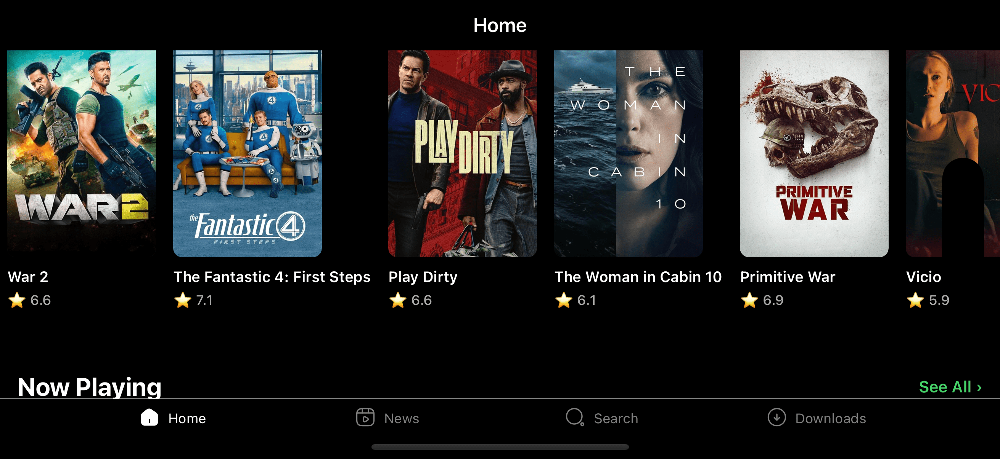
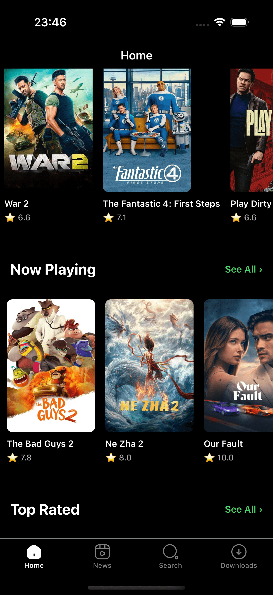
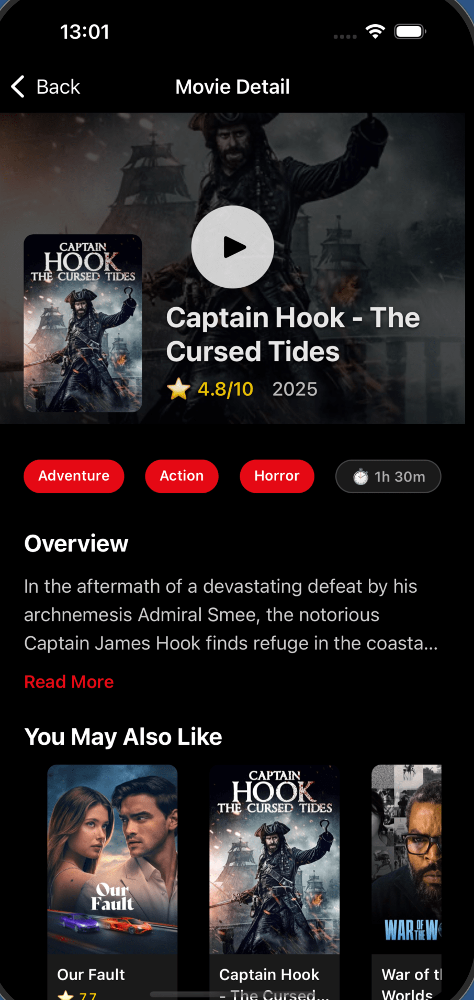

# Netflix Clone - React Native

https://github.com/yasin-erkan/Netflix-Clone-Mobile-App This project replicates the core UI/UX features of Netflix and integrates with The Movie Database (TMDB) API to fetch real movie data.

> **Note:** This project is currently under active development. Features are being added incrementally.

## 📱 Features Implemented

### ✅ Current Features

- **Bottom Tab Navigation** with 4 main sections:
  - Home (Popular, Now Playing, Top Rated, Upcoming)
  - My List (Save favorite movies)
  - Search (Find movies)
  - Downloads (Watch Later list)
- **Home Screen** with movie sections:
  - Popular Movies
  - Now Playing
  - Top Rated
  - Upcoming
- **Movie List Screen** with category filtering
- **Movie Detail Screen** featuring:
  - Hero section with backdrop image and play button
  - Movie poster with shadow effects
  - Title, rating, and release year
  - Genre tags and duration
  - Overview with expandable "Read More" functionality
  - "You May Also Like" section with horizontal scrolling (random recommendations)
  - Action buttons (Add to My List, Rate, Watch Later)
- **My List**: Save and remove your favorite movies
- **Watch Later** (Downloads): Create your watch list
- **Search**: Real-time movie search with TMDB API
- **Movie Cards** with:
  - High-quality posters from TMDB
  - Movie titles
  - Rating display with stars
  - Smooth horizontal scrolling
- **Redux Toolkit Integration** for state management
- **Axios Instance Configuration** for API calls
- **Movie Data Integration** with TMDB API (4 categories)
- **Custom Tab Bar Icons** using Iconsax
- **Safe Area Context** for proper display on all devices
- **TypeScript** for type safety
- **Custom App Icon & Splash Screen**

### 🚧 In Progress

- Additional features and screens are being developed

## 📸 Screenshots

<div align="center">
  <div style="display: flex; flex-wrap: wrap; justify-content: center; gap: 15px; margin-top: 20px;">
    
    
    
  </div>
</div>

## 🛠 Tech Stack

- **Framework:** React Native 0.82.0
- **Language:** TypeScript 5.8.3
- **Navigation:** React Navigation (Bottom Tabs & Native Stack)
- **State Management:** Redux Toolkit 2.9.0
- **HTTP Client:** Axios 1.12.2
- **Icons:** Iconsax React Native
- **UI Components:** React Native SVG, Safe Area Context

## 📋 Prerequisites

Before running this project, make sure you have:

- Node.js >= 20
- npm or yarn
- React Native development environment set up
  - For iOS: Xcode (macOS only)
  - For Android: Android Studio
- CocoaPods (for iOS)
- TMDB API Key

## 🚀 Getting Started

### 1. Clone the repository

```bash
git clone <repository-url>
cd netflixClone
```

### 2. Install dependencies

```bash
npm install
```

### 3. Install iOS dependencies (macOS only)

```bash
cd ios
pod install
cd ..
```

### 4. Configure API Keys

Create your API key and token from [The Movie Database (TMDB)](https://www.themoviedb.org/settings/api) and add them to:

```
src/utils/constants.ts
```

### 5. Run the application

#### For iOS:

```bash
npm run ios
```

#### For Android:

```bash
npm run android
```

#### Start Metro Bundler:

```bash
npm start
```

## 📁 Project Structure

```
netflixClone/
├── src/
│   ├── assets/          # Static assets (fonts, icons, images)
│   ├── components/      # Reusable components
│   │   ├── home/
│   │   └── router/
│   ├── models/          # TypeScript interfaces and types
│   │   ├── data/
│   │   └── ui/
│   ├── router/          # Navigation configuration
│   ├── screens/         #  Application screens
│   │   ├── home/
│   │   ├── myList/
│   │   ├── search/
│   │   └── downloads/
│   ├── service/         # API configuration
│   │   ├── instance.ts  # Axios instance
│   │   ├── urls.ts      # API endpoints
│   │   └── verbs.ts     # HTTP methods
│   ├── store/           # Redux store configuration
│   │   ├── actions/     # Redux async actions
│   │   ├── slices/      # Redux slices
│   │   └── store.ts     # Store configuration
│   ├── styles/          # Global styles
│   ├── themes/          # Theme configuration
│   └── utils/           # Utility functions and constants
├── android/             # Android native files
├── ios/                 # iOS native files
└── App.tsx             # Root component
```

## 🔑 Key Components

### Redux Store

- **Movie Slice:** Manages movie data state
- **Actions:** Async thunks for API calls
- **Selectors:** State selectors for components

### Navigation

- **Root Navigator:** Main navigation stack
- **Bottom Tab Navigator:** Tab-based navigation for main screens

### API Integration

- Axios instance with pre-configured headers and base URL
- Organized API endpoints and HTTP methods
- Integration with TMDB API for movie data

## 📝 Available Scripts

- `npm start` - Start Metro bundler
- `npm run ios` - Run on iOS simulator
- `npm run android` - Run on Android emulator
- `npm run lint` - Run ESLint
- `npm test` - Run tests

## 🎨 Customization

The app features a dark theme inspired by Netflix's UI:

- Black background for screens and navigation
- White and gray for text and icons
- Custom tab bar with active/inactive states

## 📱 Platform Support

- ✅ iOS
- ✅ Android

## 🤝 Contributing

This is a personal learning project. Suggestions and feedback are welcome!

## 📄 License

This project is for educational purposes only.

## 🙏 Acknowledgments

- [The Movie Database (TMDB)](https://www.themoviedb.org/) for providing the movie data API
- Netflix for UI/UX inspiration
- React Native community for excellent tools and libraries

---

**Status:** 🚧 Work in Progress - Actively being developed

**Last Updated:** October 2025
